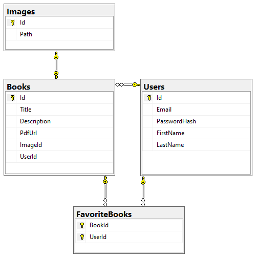

# PMG Book Library

PMG Book Library is a project that manages and stores books information. It allows users to add their own books, edit or delete them and mark some books as favorite to review them later.

## Description

The application is build with Windows Forms(UI framework for building Windows desktop apps) in Visual Studio 2019 and it uses MVC. It is written on .NET Core 3.1. and integrates SQL Database. The system require user authentication (Login/Register) and provides a pleasing UI design

## Features
* MVC Architecture
* User Authentication (Login/Register)
* Password Hashing
* Fields Validations
* SQL DB Integration
* Complete CRUD operations support

## Dependencies
the project uses the following NuGet packages and extensions
* [MS EF Core SqlServer](https://www.nuget.org/packages/Microsoft.EntityFrameworkCore.SqlServer/)
* [MS EF Core Tools](https://www.nuget.org/packages/Microsoft.EntityFrameworkCore.Tools)
* [MS EF Core Design](https://www.nuget.org/packages/Microsoft.EntityFrameworkCore.Design/)
* [GitHub Extension for Visual Studio](https://marketplace.visualstudio.com/items?itemName=GitHub.GitHubExtensionforVisualStudio)

## Database Diagram

## Authors

Contributors names and contact info

ex. [hristova23](https://github.com/hristova23) (email: victoriya.hristova04@gmail.com)
[@facebook](https://www.facebook.com/profile.php?id=100009588433228) [@instagram](https://www.instagram.com/hristova__viktoria/)

## Acknowledgments

Inspiration, icons, code snippets, etc.
* [iconsdb](https://www.iconsdb.com/)
* [stackoverflow](https://stackoverflow.com/) :D
